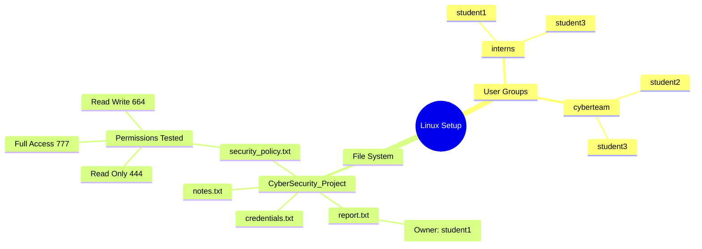

# Linux Assignment Visualization

This mind map breaks down the core concepts of the assignment: the groups created, the users assigned to them, and the file permission structure.

```mermaid
mindmap
  root((Linux Setup))
    User Groups
      interns
        student1
        student3
      cyberteam
        student2
        student3
    File System
      CyberSecurity_Project
        report.txt
          ::icon(fa fa-user)
          [Owner: student1]
        notes.txt
        credentials.txt
        security_policy.txt
          ::icon(fa fa-lock)
          Permissions Tested
            Read Only 444
            Read Write 664
            Full Access 777
```
